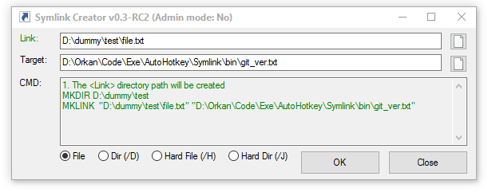

# Symlink Creator

The AutoHotkey GUI for MKLINK command line tool

## Requirements

The [AutoHotkey](www.autohotkey.com) compiler is required to run any *.ahk script. Note that this isn't the case if you run the compiled EXE file.

## Author

* [Orkan](https://github.com/orkan) - *Initial work*

## License

This project is licensed under the MIT License - see the [LICENSE.md](LICENSE.md) file for details
