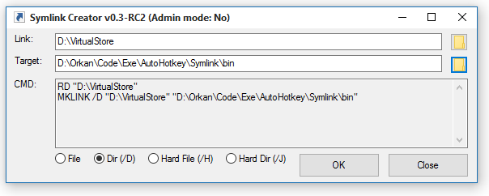

# Symlink Creator
The AutoHotkey GUI for MKLINK command line tool

## Basic features:

### Automaticaly removes <link> resources before creating new one:
*Note: only empty files/dirs or symlinks are removed*

### Automaticaly creates <link> directory path if it not exists yet:

### Gives you a hint of basic mistakes:

### Accepts command line arguments:
- *Use system Send To menu to send resource paths from file Explorer stright to the app!*
- *The Drag & Drop feature also works, but due to Windows UAC is switched off if you try to run this app as an Administrator - which is required by MKLINK*

### Other useful features:

### Multi Language support
1. Create symlink.lang.[lang].ini
2. Edit symlink.ini, change lang=[lang]

## Requirements

The [AutoHotkey](https://www.autohotkey.com/) compiler is required to run any *.ahk script. Note that this isn't the case if you run the compiled EXE file

## Author

* [Orkan](https://github.com/orkan) - *Initial work*

## License

This project is licensed under the MIT License - see the [LICENSE.md](LICENSE.md) file for details
